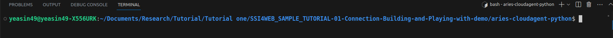

# ACA-PY and Bifold


NOTE: This tutorial was tested and Prepare using 
-   Node version 16.15.0
-   python version 3.10.6
-   pip3 version 23.0
-   yarn 3.3.1
-   ACA-PY github repo release 7.5( **There will be a major update 8.0 soon which will bring breaking changes** ) 


# Section 01 - Prerequisite

## 1. Running in play with docker

The Alice/Faber demo is the (in)famous first verifiable credentials demo. Alice, a former student of Faber College ("Knowledge is Good"), connects with the College, is issued a credential about her degree and then is asked by the College for a proof. There are a variety of ways of running the demo. The easiest is in your browser using a site ("Play with VON") that let's you run docker containers without installing anything. Alternatively, you can run locally on docker (our recommendation), or using python on your local machine. Each approach is covered below.


In your browser, go to the docker playground service [Play with Docker](https://labs.play-with-docker.com/). On the title screen, click "Start". On the next screen, click (in the left menu) "+Add a new instance".  That will start up a terminal in your browser. Run the following commands to start the Faber agent:

```bash
git clone https://github.com/hyperledger/aries-cloudagent-python
cd aries-cloudagent-python/demo
LEDGER_URL=http://dev.greenlight.bcovrin.vonx.io ./run_demo faber
```

Now to start Alice's agent. Click the "+Add a new instance" button again to open another terminal session. Run the following commands to start Alice's agent:

```bash
git clone https://github.com/hyperledger/aries-cloudagent-python
cd aries-cloudagent-python/demo
LEDGER_URL=http://dev.greenlight.bcovrin.vonx.io ./run_demo alice
```

Alice's agent is now running.

Jump to the [Follow the Script](#follow-the-script) section below for further instructions.


### Follow The Script

With both the Alice and Faber agents started, go to the Faber terminal window. The Faber agent has created and displayed an invitation. Copy this invitation and paste it at the Alice prompt. The agents will connect and then show a menu of options:

Faber:

```
    (1) Issue Credential
    (2) Send Proof Request
    (3) Send Message
    (4) Create New Invitation
    (T) Toggle tracing on credential/proof exchange
    (X) Exit?
```

Alice:

```
    (3) Send Message
    (4) Input New Invitation
    (X) Exit?
```

#### Exchanging Messages

Feel free to use the "3" option to send messages back and forth between the agents. Fun, eh? Those are secure, end-to-end encrypted messages.

#### Issuing and Proving Credentials

When ready to test the credentials exchange protocols, go to the Faber prompt, enter "1" to send a credential, and then "2" to request a proof.

You don't need to do anything with Alice's agent - her agent is implemented to automatically receive credentials and respond to proof requests.

Note there is an option "2a" to initiate a connectionless proof - you can execute this option but it will only work end-to-end when connecting to Faber from a mobile agent.

## Running locally using docker
Now, we ill run the demo to our local machine. For this follow these steps:

1. Cloe the repo: 

```shell
git clone https://github.com/hyperledger/aries-cloudagent-python
```

2. Go to ACA-PY directory using the command ```cd aries-cloudagent-python``` and prepare your laptop by installing the requirements: 

```shell
pip3 install -r demo/requirements.txt
```
3. Now, run the command go to the demo directory: ```cd demo```

4. While in the demo directory run the command to start faber agent:

```shell
 LEDGER_URL=http://dev.greenlight.bcovrin.vonx.io ./run_demo faber
```

5. Open another console in the demo directory and issue this command to start alice: 

```shell
LEDGER_URL=http://dev.greenlight.bcovrin.vonx.io ./run_demo alice
```
6. Now, again jump to the [Follow the Script](#follow-the-script) section above for further instructions.
	
Everything works, then your laptop is ready for the development in full setup.


# Section 02 -  Complete Setup
## Repository Setup

1. create a folder. For this tutorial, we are naming it **SSI4WEB_TUTORIAL**

2. go to the **SS4WEB_TUTORIAL** folder and from there Clone/download the repo: 

```shell
git clone https://github.com/YEASIN49/SSI4WEB_SAMPLE_TUTORIAL-01-Connection-Building-and-Playing-with-demo.git
```

The mentioned github repository contains some important files which are:

-  aries-mobile-agent-react-native: This is the mobile wallet/end agent
-    aries-cloudagent-python: This is the aca-py agent that we will use
-    MySSIController: This is the controller through which we will utilise the aca-py agent's API and intereact with our agent and wallet from browser
-    Aries Mobile Agent Config: This file contains some data/configuration that we need for the wallet configuration. 

After cloning/downloading, go to aries-cloudagent-python directory. You can use the command ```cd SSI4WEB_SAMPLE_TUTORIAL-01-Connection-Building-and-Playing-with-demo/aries-cloudagent-python``` for this. Now prepare your laptop by installing the requirements below. NOTE: Make sure your terminal path is now pointing at at aries-cloudagent-python directory like the image below:



Now, run the commands below.
	
3. Now, Prepare your laptop by installing the requirements: 

```shell
pip3 install -r aries-cloudagent-python/demo/requirements.txt
```


## Configuring The Frameworks Together

### Part 1: Configuring the mobile agent

### Prerequisite
Before configuring the mobile agent, you must ensure that:
-   Android API 29.0.3 or lower. I tested the tutorial using 25 and 29.
-   You have the android sdk build-tools version 30.0.2, 30.0.3 and 33.0.1
-   You have android sdk NDK version 21.4.7075529
Easiest way you can find and add these two tools is from the android studio. Open the SDK manager and find Android SDK. From there you need to tick the specified versions and apply it.
-   In addition you need the set environment path for anrdoid. Alternative you can create a file inside the ```packages>legacy>app>android``` and name it ```local.properties``` and paste the android sdk path in the mentioned format below:
```shell
sdk.dir = YOUR_PATH_TO_ANDROID_SDK_FOLDER
```

**NOTE:** After you are ready with the Prerequisite you need to remember.  
1. Check the Aries Mobile Agent Config Zip file and you will find there is a directory called: Aries Mobile Agent Config. Within this directory, there are three things: a directory named bcovrin-test-net, a file called index.js and another file called AgentService.js. 

2. Paste the bcovrin-test-net directory to the the ```packages/legacy/core/configs/ledgers/indy``` directory of the Aries Mobile Agent React Native codebase. 

3. Also, copy content of index.js file from ```Aries Mobile Agent Config``` and paste it into the index.ts file within the ```packages/legacy/core/configs/ledgers/indy``` directory of the Aries Mobile Agent React Native codebase. While pasting it into the index.ts file remove the previous content of ```index.ts``` file.

4. from the terminal go to the ```packages/legacy/core/configs/ledgers/indy``` directory of the Aries Mobile Agent React Native codebase. While pasting it into the index.ts file remove the previous content of ```index.ts``` file.

4. from the terminal go to the aries-mobile-agent-react-native directory and run:
```shell
yarn install
```

5. Now, in the app directory add an .env file containing:

```shell
MEDIATOR_URL=https://public.mediator.indiciotech.io?c_i=eyJAdHlwZSI6ICJkaWQ6c292OkJ6Q2JzTlloTXJqSGlxWkRUVUFTSGc7c3BlYy9jb25uZWN0aW9ucy8xLjAvaW52aXRhdGlvbiIsICJAaWQiOiAiMDVlYzM5NDItYTEyOS00YWE3LWEzZDQtYTJmNDgwYzNjZThhIiwgInNlcnZpY2VFbmRwb2ludCI6ICJodHRwczovL3B1YmxpYy5tZWRpYXRvci5pbmRpY2lvdGVjaC5pbyIsICJyZWNpcGllbnRLZXlzIjogWyJDc2dIQVpxSktuWlRmc3h0MmRIR3JjN3U2M3ljeFlEZ25RdEZMeFhpeDIzYiJdLCAibGFiZWwiOiAiSW5kaWNpbyBQdWJsaWMgTWVkaWF0b3IifQ==
GENESIS_URL=http://dev.greenlight.bcovrin.vonx.io/genesis
```

Your Aries Mobile Agent React Native is now ready to run. We will run after configuring the faber and controller

**Note:** Have a look to these two pages: 
* [Official Readme.md](https://github.com/hyperledger/aries-mobile-agent-react-native), 
* [developer.md](https://github.com/hyperledger/aries-mobile-agent-react-native/blob/main/DEVELOPER.md). 
* Currently npm has some peer dependency issue. HOwever, it can be used by resolving it. But, since bifold shifting towards yarn. we will try to use yarn for Aries Mobile Agent React Native from now on. 

### Part 2: Controller Setup
1. Now, go to the directory called ```MySSIController```. This directory, contains the code of aca-py controller. 
2. Move the directory where your ACA-PY and Aries Mobile Agent React Native resides.

3. Now, go to the **MySSIController** director from the terminal and run the  command below. But make sure the terminal path is inside the MySSIController directory.

```shell
npm install
```

### Part 3: Modify ACA-PY faber agent to interact with  

1. Go to this url : 
```shell
http://dev.greenlight.bcovrin.vonx.io
``` 

2. From there, select **register from seed** option and register a new DID by providing a random secret 32 characters seed value and keeping the role as endorser. 

3. After registering you will get seed, DID and a verykey. Store the generated DID and verkey along with the seed in a safe place.

4. Now, search the **agent.py** file which is inside ```aries-cloudagent-python/demo/unners/support``` directory. Now, search this line which is: ```if self.seed`` in the agent.py of the aca-py codebase. This is located nearby line number 359 in the agent.py file. To be more specific, the code is: 
```python
if self.seed:
    result.append(("--seed", self.seed))
```

5. Now, replace the ```self.seed``` with the seed value that you get from step-3 by registering the DID. You should wrap the seed within a single or double quote for example:
```python
if self.seed:
    result.append(("--seed", "aF5s4d4bkfhvolsdf135A5sdf3Sfsf46"))
        
```

6. Now, open the **faber-local.sh** file located in the ```aries-cloudagent-python/demo``` directory. You will find an option called **PYTHONPATH** there. Add your seed value in a similar foramte like: ```--seed aF5s4d4bkfhvolsdf135A5sdf3Sfsf46 \``` there.

    Additionally, change the genesis url to ```http://dev.greenlight.bcovrin.vonx.io/genesis```, which will look like this:

```
--genesis-url http://dev.greenlight.bcovrin.vonx.io/genesis \
```

Finally we need to add --endpoint and --webhooks so that the ACA-PY can communicate with controller and Metro which is a bundler for the Aries Mobile Agent React Native.

But, to communicate with them we need to disclose port 8020 through which webhooks of ACA-PY communicates. Additionally, we need to disclose port 9999 which will be used by the controller.

These ports are needed when we run the ACA-PY faber agent.

To disclose the port we can use ngrok to create tunnel which enable open acces to specific port. So first, install ngrok using the command:

```shell
curl -s https://ngrok-agent.s3.amazonaws.com/ngrok.asc | sudo tee /etc/apt/trusted.gpg.d/ngrok.asc >/dev/null && echo "deb https://ngrok-agent.s3.amazonaws.com buster main" | sudo tee /etc/apt/sources.list.d/ngrok.list && sudo apt update && sudo apt install ngrok
```
7. After installing, add auth token by running the command: 
```shell
ngrok config add-authtoken REPLACE_THIS_WORD_BY_A_RANDOM_TOKEN
```
This command, will create a config file called ```ngrok.yml``` in your ```Home/.config/ngrok```. Make sure, you are viewing the hidden files inside ```Home``` directory because the ```.confi``` file is a hidden file.

**NOTE:** Depending on the ubuntu version and distribution and also the way you install it, the location of the ngrok.yml file may vary. Therefore, if you don't find the file, try searching it from the terminal. I am using ubuntu v22.4.0.

8. Now, copy the content below and paste it to the mentioned ```ngrok.yml``` file
```yml
version: "2"
authtoken: REPLACE_THIS_WORD_BY_THE_TOKEN_YOU_ENTERED_EARLIER
tunnels:
    first:
        addr: 8020
        proto: http
    second:
        addr: 9999
        proto: http
```
Finally, you are done configuring the ACA-PY. However, we need to modify --endpoint and --wehbhooks but this is modifications are needed every time we start ngrok therefore, we will dicuss how to modify it in the **Running The Agent. Wallet and Controller** section.


## Running The Agent, Wallet and Controller

### 1. Run ngrok tunnel

1. First, we will start the tunnel using ngrok:
```shell
ngrok start --all
```

After running the command you should see something like below: 

```shell
ngrok                                                                                    (Ctrl+C to quit)
                                                                                                         
Want to improve ngrok? Take our survey:  https://ngrok.com/survey                                        
                                                                                                         
Session Status                online                                                                     
Account                       Yeasin (Plan: Free)                                                        
Version                       3.1.1                                                                      
Region                        India (in)                                                                 
Latency                       -                                                                          
Web Interface                 http://127.0.0.1:4040                                                      
Forwarding                    https://1d54-103-110-217-248.in.ngrok.io -> http://localhost:9999          
Forwarding                    https://eb87-103-110-217-248.in.ngrok.io -> http://localhost:8020          
                                                                                                         
Connections                   ttl     opn     rt1     rt5     p50     p90                                
                              0       0       0.00    0.00    0.00    0.00  
```

### 2. Run Controller

1. Firts, start the local mongoDB service using the command: 
```shell
service mongod start
```

2. Next, run the server using:

```shell
npm start
```
This will start the controller in http://localhost:9999 in your browser.


### 3. Run the Mediator and Build the Wallet to mobile
_**Note:** bundling and building the app in your mobile device only one attempt. Once the app installed in your mobile you can use it in future without bundling again. However, if you update mobile agent you need to build it again._

In this tutorial, we will use real mobile device instead of using the mobile emulator.

#### 1. Connecting the smartphone

1. First, plug in your mobile into your computer and run the command mentioned below to check whether your mobile is connected or not:
```shell
adb devices
```

After running the command if you see something link below, you can skip step 2 and 3.
```shell
List of devices attached
57396ee8	device

```
Here, 57396ee8 is my connected mobile.

If you do not see conencted device, follow from step 2.

2. run the command : ```lsusb```. This will print something like below:

```shell
Bus 002 Device 001: ID 1d6b:0003 Linux Foundation 3.0 root hub
Bus 001 Device 004: ID 13d3:3496 IMC Networks 
Bus 001 Device 003: ID 13d3:5a01 IMC Networks USB2.0 VGA UVC WebCam
Bus 001 Device 002: ID 0bda:0129 Realtek Semiconductor Corp. RTS5129 Card Reader Controller
Bus 001 Device 005: ID 2717:ff08 Xiaomi Inc. Redmi Note 3 (ADB Interface)
Bus 001 Device 001: ID 1d6b:0002 Linux Foundation 2.0 root hub
```

Here, ```us 001 Device 005: ID 2717:ff08 Xiaomi Inc. Redmi Note 3 (ADB Interface)``` is my mobile connected via usb cable.

You want the line that represents your phone. If you're in doubt, try unplugging your phone and running the command again.

From the above line, you want to grab the first four digits from the device ID. For my case the ID is: ```2717:ff08```. Therefore, the first four digits are: ```2717```


3. Now, run the command below:

```shell
echo 'SUBSYSTEM=="usb", ATTR{idVendor}=="4_DIGITS_OF_YOUR_DEVICE", MODE="0666", GROUP="plugdev"' | sudo tee /etc/udev/rules.d/51-android-usb.rules
```

Make sure that you replace _4_DIGITS_OF_YOUR_DEVICE_ with the identifier you get in the above command.

Now, run the command: ```adb devices```. If you do this correctly, you should see a device connected now similar to :

```shell
List of devices attached
57396ee8	device
```

#### 2. Running the mediator and building
1. Open the terminal and make sure your current is pointing the the ```app``` directory inside ```legacy```. Now Run:
```shell
yarn start
```

This will start the mediator.

2. If you want to build the mobile agent, open a new terminal and again go to the same terminal path and run:

```shell
yarn run android
```

This will build an apk file to your android device.

### 4. Run Faber Agent
1. Copy the ngrok link respect to the ```http://localhost:8020 ```. The link should be similar to the ```https://eb87-103-110-217-248.in.ngrok.io``` mentioned above.

2. Now again, open the **faber-local.sh** file located in the ```aries-cloudagent-python/demo``` directory. The **PYTHONPATH** inside the file contains multiple options. One of the option is ```--endpoint```, you have to replace it's value with the copied ngrok link similar to: ```--endpoint https://eb87-103-110-217-248.in.ngrok.io \```.

3. Now copy the ngrok link of ```http://localhost:9999``` from the terminal. Add a new option to the **PYTHONPATH** which is ```--webhook-url https://1d54-103-110-217-248.in.ngrok.io/webhooks \```. Here, the ngrok link is the respective link of http://localhost:9999.

4. Now we have to add these exact two option to the **agent.py** file located in ```aries-cloudagent-python/demo/unners/support``` directory. To do this, search ```def get_agent_args(self):``` in the **agent.py** file. You will find a function similar to below:
```shell
def get_agent_args(self):
        result = [
            ("--endpoint", self.endpoint),
            ("--label", self.label),
            "--auto-ping-connection",
            "--auto-respond-messages",
            ("--inbound-transport", "http", "0.0.0.0", str(self.http_port)),
            ("--outbound-transport", "http"),
            ("--admin", "0.0.0.0", str(self.admin_port)),
            "--admin-insecure-mode",
            ("--wallet-type", self.wallet_type),
            ("--wallet-name", self.wallet_name),
            ("--wallet-key", self.wallet_key),
            "--preserve-exchange-records",
            "--auto-provision",
            "--public-invites",
        ]
```
We will add ```--endpoint``` and ```--webhook-url``` inside the result array.

5. first add the ngrok link of http://localhost:8020 for ```--endpoint``` option which should be similar to this: ```("--endpoint", "https://eb87-103-110-217-248.in.ngrok.io")```. Also add the ngrok link of http://localhost:9999 to the ```--webhook-url``` parameter. Which should be similar to this: ```("--webhook-url", "https://1d54-103-110-217-248.in.ngrok.io/webhooks"),```.

After adding, these two parameters, you should have a similar result like below:

```shell
 def get_agent_args(self):
        result = [
            ("--endpoint", "https://eb87-103-110-217-248.in.ngrok.io"),
            ("--label", self.label),
            "--auto-ping-connection",
            "--auto-respond-messages",
            ("--inbound-transport", "http", "0.0.0.0", str(self.http_port)),
            ("--outbound-transport", "http"),
            ("--admin", "0.0.0.0", str(self.admin_port)),
            "--admin-insecure-mode",
            ("--wallet-type", self.wallet_type),
            ("--wallet-name", self.wallet_name),
            ("--wallet-key", self.wallet_key),
            "--preserve-exchange-records",
            "--auto-provision",
            "--public-invites",
            ("--webhook-url", "https://1d54-103-110-217-248.in.ngrok.io/webhooks"),
        ]
```

6. Finally, faber is ready to run:
```shell
LEDGER_URL=http://dev.greenlight.bcovrin.vonx.io ./run_demo faber
```

This will take few minutes and should run faber and show a QR code to the terminal. You may see this video provided in this repo to understand, How the process works.


